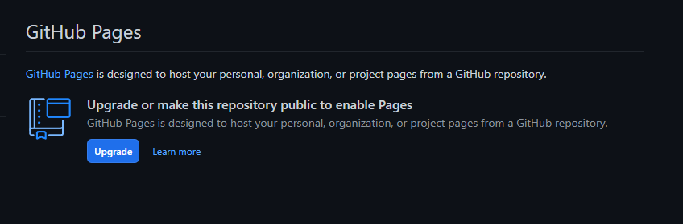

# Sim Docs Sample Template
This project is just an example of how to use [Obsidian.Md](https://obsidian.md/) and [Material for MkDocs](https://squidfunk.github.io/mkdocs-material/) and  to generate documentation to host on [Github Pages](https://pages.github.com/).

> [!WARNING] Github Pages Limitation
> Github free account only allows public repos to be hosted on Github Pages

You can access the link at [https://dvdrepomain.github.io/sim-docs/](https://dvdrepomain.github.io/sim-docs/)
